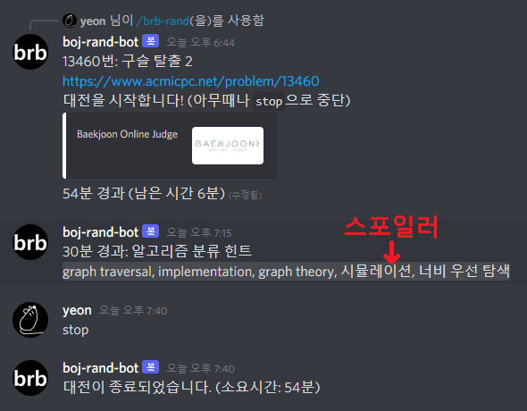

# boj-rand-bot

[백준 온라인 저지(BOJ)](https://www.acmicpc.net/)에서 풀지 않은 문제를 랜덤하게 뽑아주는 디스코드 봇

## 커맨드 사용법

`/brb-rand` 로 사용하며, 아래 옵션을 사용할 수 있습니다.
> 1. `competitors`: [필수] 참가자들의 백준 아이디 (공백으로 구분)
> 2. `options`: solved.ac 검색 옵션 (예. `tier:b5..g1`)
> 3. `tag_hint_minutes`: 알고리즘 분류를 공개할 시간 (0분이면 비공개, 기본값 30분 경과시)\
  (알고리즘 분류는 스포일러 처리된 메시지로 전송됩니다.)
> 4. `battle_timeout`: 대전 자동 종료 시간 (0분이면 자동 종료 안함, 기본값 60분 경과시)
> 5. `alert_minutes`: 추가 알림 시간 (기본값 꺼짐)

대전 시작 후 `stop`으로 언제든지 바로 종료할 수 있습니다.

`options`에는 [solved.ac 고급 검색](https://solved.ac/search)에서 사용되는 모든 연산을 사용할 수 있습니다.

아래는 사용 예시입니다.

> 1. 기본값\
> /brb-rand `competitors: copyrat90`
> 2. 친구와의 대전!\
> /brb-rand `competitors: copyrat90 catspanner90` 
> 3. 친구가 이미 푼 문제 중, 저는 풀지 않은 문제를 랜덤으로 골라주세요.\
> /brb-rand `competitors: copyrat90` `options: solved_by:catspanner90`
> 4. Bronze 문제 3분 안에 푸는 연습, 2분 경과시 위험 신호\
> /brb-rand `competitors: copyrat90` `options: tier:b5..b1` `battle_timeout: 3` `alert_minutes: 2`
> 5. 시간 제한 없이, 힌트 공개도 없이 풀고 싶어요.\
> /brb-rand `competitors: copyrat90` `tag_hint_minutes: 0` `battle_timeout: 0`
> 6. CLASS 5 문제 중 Platinum 문제는 제외하고 풀래요.\
> /brb-rand `competitors: copyrat90` `options: in_class:5&~tier:p5..p1`

## 봇 돌리는 법

0. 이 저장소를 clone
1. Python 3.8 이상 버전으로 설치
2. [Discord Developer Portal](https://discord.com/developers/applications) 에서 디스코드 봇을 생성한 후 bot token 을 `token.txt` 라는 이름으로 같은 폴더에 저장
3. `pip install -r requirements.txt` 로 필요한 패키지 설치
4. `python main.py` 로 봇 실행

## FAQ

Q1. 봇을 직접 만들어서 돌렸는데, `/brb-rand` 쳐도 아무것도 안 뜹니다.\
A1. 슬래시 커맨드가 디스코드 서버에 등록되는 데 30분 정도 소요될 수 있습니다.

## 라이선스

본 레포지토리는 [MIT/Expat 라이선스](LICENSE) 하에 배포됩니다.

## 사용하는 것들

1. [Nextcord](https://github.com/nextcord/nextcord/) ([MIT License](https://github.com/nextcord/nextcord/blob/master/LICENSE))
2. [solved.ac API v3](https://github.com/solvedac/unofficial-documentation)
3. [requests](https://github.com/psf/requests) ([Apache License 2.0](https://github.com/psf/requests/blob/main/LICENSE))
